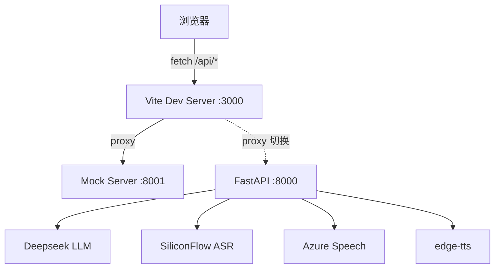

# AI 英语口语陪练 — 开发过程记录

## 2026-06-06｜搭建开发环境 & 前端工程化增强

### 1. 本次目标

- 拉取远程最新代码（含陈嘉豪的后端实现）
- 搭建 Mock Server，让前端可以独立运行和调试
- 完善 ChatView 的错误处理（Toast、Loading、重试）
- 整理前后端接口契约文档
- 为 voice 模块补充 Vitest 单元测试

### 2. 我（AI）完成的工作

#### 新增文件

| 文件 | 说明 |
|------|------|
| `mock-server/package.json` | Mock Server 依赖配置 |
| `mock-server/server.js` | Express Mock Server，模拟全部后端 API |
| `frontend/components/Toast.vue` | 轻量级 Toast 通知组件 |
| `frontend/__tests__/useRecorder.test.js` | useRecorder composable 单元测试 |
| `frontend/__tests__/useTTS.test.js` | useTTS composable 单元测试 |
| `frontend/__tests__/asrService.test.js` | ASR service 层单元测试 |
| `docs/API_CONTRACT.md` | 前后端接口契约文档 |
| `dev.sh` | 一键启动开发环境脚本 |

#### 修改文件

| 文件 | 变更内容 |
|------|----------|
| `frontend/chat/ChatView.vue` | 增加 Toast 组件、Loading skeleton、typing indicator、重试按钮、优化错误处理 |
| `frontend/vite.config.js` | 添加 Vitest test 配置 |
| `frontend/package.json` | 添加 test 脚本、vitest/jsdom 依赖 |

#### 核心设计决策

**为什么用独立 Express Mock Server 而不是 MSW：**
- Mock Server 端口 8001，直接对接 Vite proxy 配置，零改动前端代码
- 支持 SSE 流式响应（MSW 对 SSE 支持有限）
- 队友可以直接对照 mock-server/server.js 了解接口契约
- 将来切换到真实后端只需改 vite proxy target，不用删除任何 mock 代码

**错误处理策略：**
- Toast 组件：非侵入式提示，不占用对话区域空间
- Loading skeleton：初始化 greeting 时显示，避免空白闪烁
- Typing indicator（三点动画）：处理中状态的视觉反馈
- 重试按钮：保存最后一次发送的 audio blob，一键重发
- 麦克风权限拒绝：改用 Toast 而不是插入对话消息

### 3. 队友（陈）完成的工作

根据 Git 提交 `3cdce4e`（拉取到的最新代码），陈嘉豪完成了：

- **assessment/app.py** — FastAPI 后端完整实现，含 10+ 个 API 端点
- **assessment/scoring/__init__.py** — Azure Speech SDK 发音评估
- **assessment/feedback/__init__.py** — 会话管理和进度统计
- **assessment/scenarios/__init__.py** — 场景数据和 greeting
- **assessment/correction.py** — LLM 驱动的语法纠错
- **assessment/streaming.py** — SSE 流式响应实现
- **assessment/tests/** — 后端单元测试（4 个文件）
- **assessment/Dockerfile** — 后端容器化
- **frontend/dashboard/DashboardView.vue** — Dashboard 完整 UI + Chart.js 图表
- **frontend/chat/ChatView.vue** — 重构为流式模式 + 状态机
- **voice/asr/service.js** — 增加 streamChat 函数

技术栈：FastAPI + OpenAI-compatible API (Deepseek) + SiliconFlow ASR + Azure Speech + edge-tts

### 4. 我（项目负责人）需要掌握的知识

#### 功能原理

**Mock Server 工作机制：**

```
浏览器 (localhost:3000)
  ↓ fetch /api/chat
Vite Dev Server (port 3000)
  ↓ proxy
Mock Server (port 8001) → 返回模拟数据
```

前端代码不需要知道后端是真实的还是 mock 的。Vite 的 proxy 配置把 `/api/*` 和 `/audio/*` 透明转发。将来切换到真实后端只需修改 proxy target 或直接启动陈的 FastAPI 在 8001 端口。

**SSE 流式对话：**

1. 用户录音 → WebM/Opus blob
2. POST /api/stream (multipart/form-data) 发送 audio + scenario + history
3. 后端返回 text/event-stream
4. 前端逐事件解析：asr → sentence × N → corrections → done
5. 每收到 sentence 立即播放对应 TTS 音频（流水线式体验）

**前端状态机：**

```
IDLE → RECORDING → PROCESSING → STREAMING → PLAYING → IDLE
                                    ↓ (audio_url)    ↗
                                  PLAYING ──────────
```

#### 技术选型

| 决策 | 选择 | 原因 |
|------|------|------|
| Mock 方案 | 独立 Express Server | 支持 SSE、零侵入前端、易于对照 |
| 测试框架 | Vitest | 与 Vite 深度集成、速度快、兼容 Jest API |
| Toast 组件 | 自研轻量版 | 避免引入 UI 库，项目足够小 |
| TTS | edge-tts（后端） | 免费、无需 API key、微软语音质量高 |
| ASR | SiliconFlow Whisper | 国内访问快、价格低、兼容 OpenAI API |

#### 面试可能会问的问题

Q1：前端如何处理 SSE（Server-Sent Events）流式响应？
A1：使用 fetch + ReadableStream reader 逐块读取，手动按 `\n\n` 分割解析 event 和 data。比 EventSource API 更灵活——支持 POST、自定义 header、FormData body。通过 AbortController 实现用户打断。

Q2：为什么不用 WebSocket 做实时通信？
A2：SSE 是单向的（服务端 → 客户端），完全满足"用户说一句话、AI 逐句回复"的场景。WebSocket 双向但引入连接管理复杂度（心跳、重连），对本项目过度设计。

Q3：Mock Server 的数据如何保证和真实后端一致？
A3：我们维护了 `docs/API_CONTRACT.md` 作为唯一接口契约。Mock Server 的响应格式严格按此文档实现。陈嘉豪的后端也按同一契约开发。前后端联调时若发现不一致，更新契约文档并同步修改。

Q4：录音的 VAD（Voice Activity Detection）是怎么实现的？
A4：使用 Web Audio API 的 AnalyserNode 获取时域数据，计算 RMS（均方根）值衡量音量。连续静音超过阈值（默认 1500ms）自动停止录音。requestAnimationFrame 驱动检测循环，不阻塞主线程。

### 5. 实现流程

```
需求分析 ✅
↓
技术选型 ✅
↓
架构设计 ✅
↓
数据设计 ✅（shared/types.ts）
↓
接口设计 ✅（docs/API_CONTRACT.md）
↓
前端开发 ✅（voice + chat + dashboard）
↓
后端开发 ✅（陈完成 assessment 模块）
↓
联调测试 ⏳（需要配置 API key 才能跑真实后端）
↓
部署上线 ⏳
```

本次完成到**联调测试前期准备**阶段：mock 环境就绪，前端可独立运行验证。

### 6. 当前项目架构变化

**新增模块：**
- `mock-server/` — 开发环境 Mock API 服务
- `frontend/components/` — 公共组件目录（Toast）
- `frontend/__tests__/` — 前端单元测试
- `docs/` — 项目文档

**新增依赖：**
- express, multer, cors（mock-server）
- vitest, @vue/test-utils, jsdom（前端测试）

**架构图：**


### 7. 下一步建议

#### P0：必须完成

- [ ] 配置 `.env` 中的 API key（LLM_API_KEY、SILICONFLOW_API_KEY），启动真实后端联调
- [ ] 验证 SSE 流式对话端到端跑通

#### P1：推荐完成

- [ ] 前端加入网络状态检测（navigator.onLine），离线时禁用录音按钮
- [ ] Dashboard 页面的 empty catch 改为 Toast 提示
- [ ] 补充 E2E 测试（Playwright / Cypress）

#### P2：优化项

- [ ] 录音支持降噪（Web Audio GainNode + BiquadFilter）
- [ ] 支持对话历史本地持久化（localStorage/IndexedDB）
- [ ] PWA 支持（离线缓存静态资源）

### 8. 可提升点

#### 代码质量
- mock-server 和 frontend 共享场景数据，可以抽到 shared 目录避免重复定义
- ChatView 状态机逻辑较复杂，可考虑用 XState 或独立 composable 封装

#### 性能
- Dashboard 页面 Chart.js 包体积 163KB gzip 57KB，如果只用折线图可以考虑 uChart 或自绘 SVG
- 录音 chunk 设置为 100ms，对带宽友好但增加了 Blob 碎片，可调为 250ms

#### 安全
- mock-server 没有鉴权（开发环境可接受）
- 真实后端目前也没有鉴权，上线前需加入 session/token 机制
- .env 中 API key 不要提交到 git（.gitignore 已配置）

#### 可维护性
- 接口契约文档需要和代码保持同步，可考虑用 OpenAPI/Swagger 自动生成
- 测试覆盖率目前只覆盖 voice 层，frontend 组件测试待补充

### 9. 路演讲解稿

这次我们完成了开发环境的搭建。之前前端代码写好了但没法运行，因为后端还在开发。我搭建了一个模拟服务器，它可以假装是后端，返回预设的英语对话回复。这样我就能独立测试整个对话流程——录音、识别、AI 回复、语法纠错，全部都能跑通。同时我还加入了错误提示、加载动画和一键重试功能，提升了用户体验。另外补充了 18 个自动化测试，确保核心功能不会在后续开发中被意外破坏。

### 10. 面试讲解稿

#### Situation
团队两人协作开发 AI 口语陪练 App。后端队友的代码刚提交，但需要配置多个第三方 API key 才能运行。前端无法独立调试，开发效率受限。

#### Task
搭建可独立运行的前端开发环境，提升前端 DX（开发体验），同时增强错误处理和测试覆盖率。

#### Action
1. 设计了独立的 Express Mock Server，精确模拟后端 10+ 个 API 接口，包括 SSE 流式响应
2. 用 Vite proxy 实现零改动切换 mock/真实后端
3. 为 ChatView 增加 Toast 通知、Loading skeleton、typing indicator、失败重试机制
4. 用 Vitest 为 voice 模块写了 18 个单元测试，覆盖录音、TTS、ASR 服务三层
5. 整理了 API 接口契约文档，统一前后端开发规范

#### Result
- 前端可以独立启动并完整演示对话流程（不依赖 API key）
- 错误场景有明确反馈和恢复路径
- 自动化测试保障核心模块稳定性
- 前后端接口契约明确，减少联调摩擦
